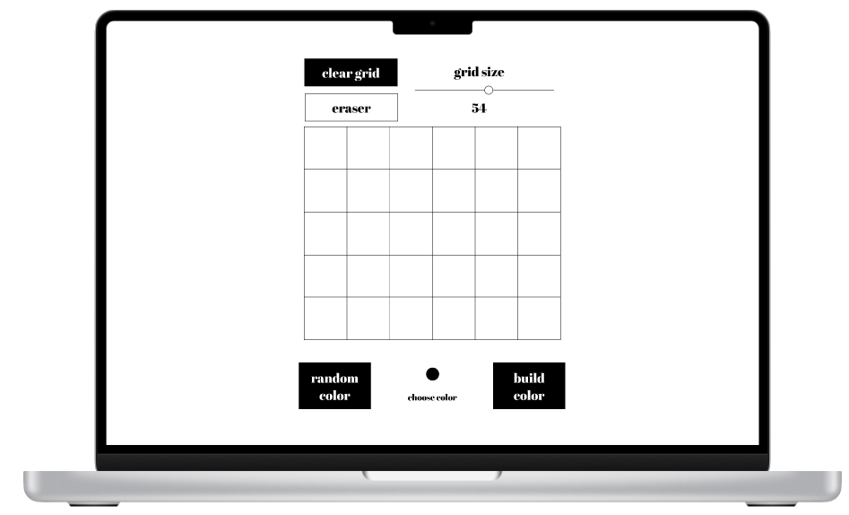

# etch-a-sketch

## Purpose
Etch a sketch functionality implemented in JavaScript as part of [The Odin Project](https://theodinproject.com) curriculum.

## Live Version

https://mogoatlhe.github.io/etch-a-sketch/
